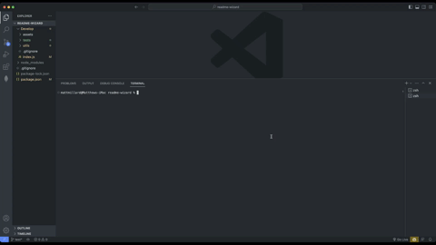

# README Wizard

## Description

A command-line application that dynamically generates a professional README file from a user's input using the package Inquirer.

## Table Of Contents

- [Installation](#installation)
- [Usage](#usage)
- [Contribution](#contribution)
- [Tests](#tests)
- [License](#license)
- [Questions](#questions)

## Installation

Feel free to clone the repository and open the project folder in your text editor. Before you launch the application, please install all the applications' dependencies, and make sure you have Node.js installed too. To initiate the application, enter the command  "npm start" in the terminal. 

## Usage

## Contribution

You can participate in this project by submitting and verifying bugs/feature requests, reviewing code changes, and improving documentation through pull requests.

## Tests

The applications' tests use the JavaScript testing framework Jest. 

## License

MIT License
A short and simple permissive license with conditions only requiring preservation of copyright and license notices. Licensed works, modifications, and larger works may be distributed under different terms and without source code.

## Questions

If you have any questions related to this project, please don't hesitate to email me: [matthew.richie.millard@gmail.com](mailto:matthew.richie.millard@gmail.com).
If you would like to check out my other projects on Github: [matthewmillard](matthewmillard).
